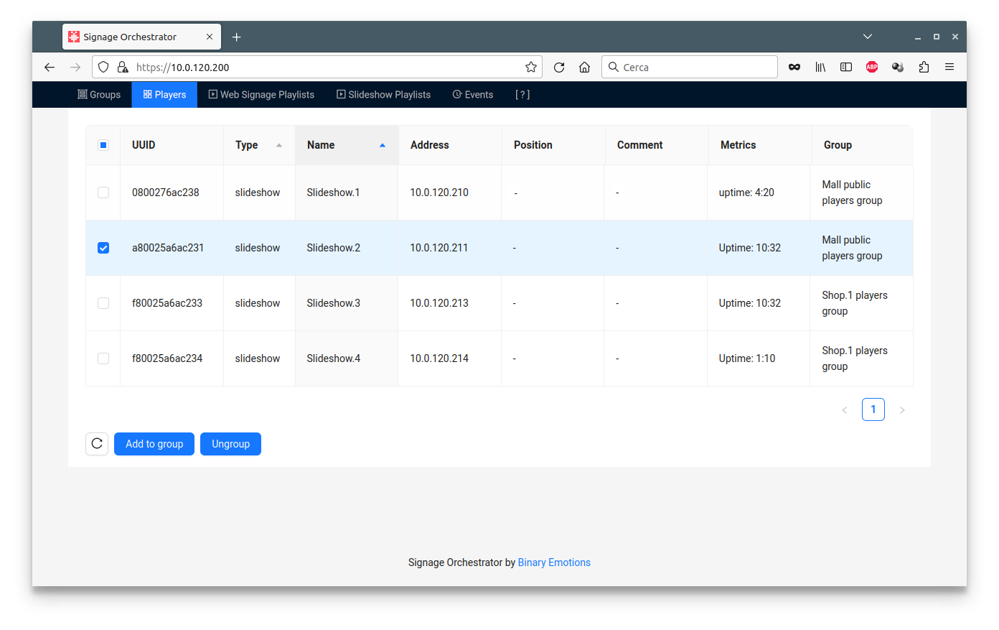
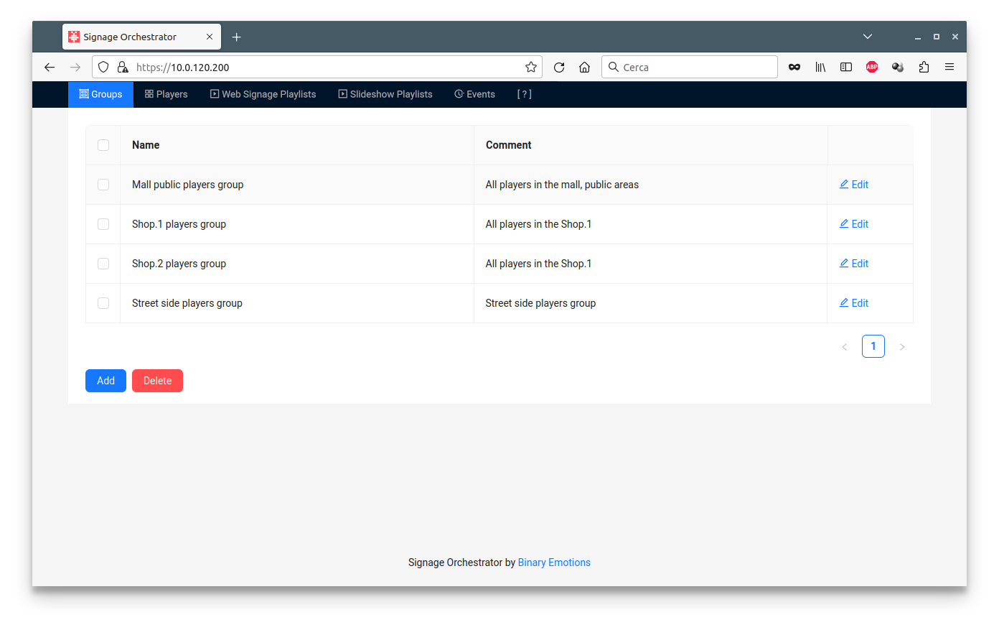
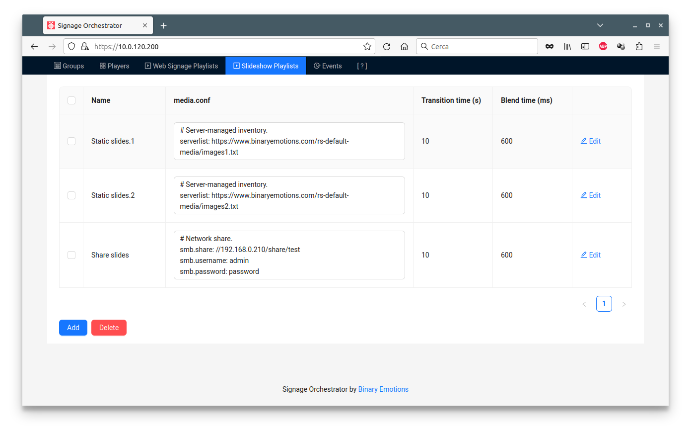
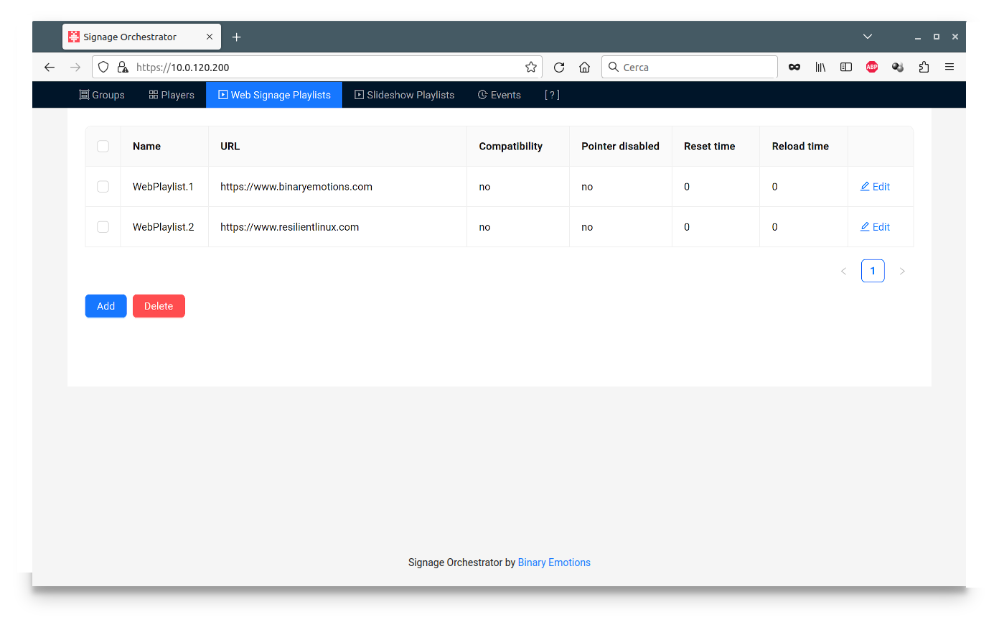
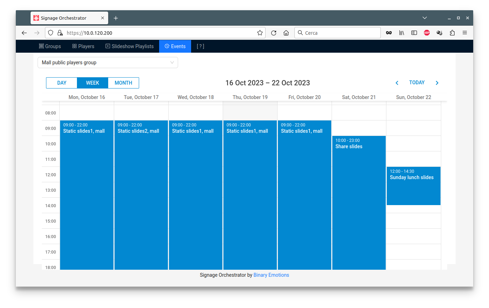
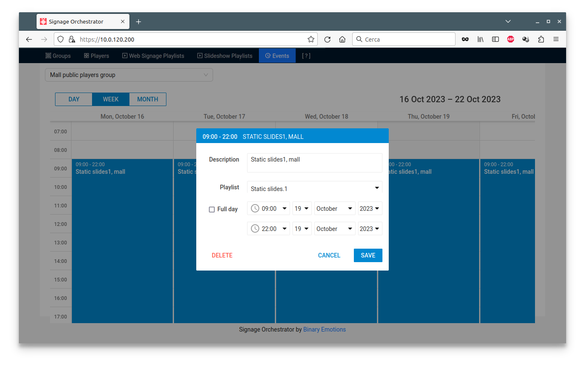
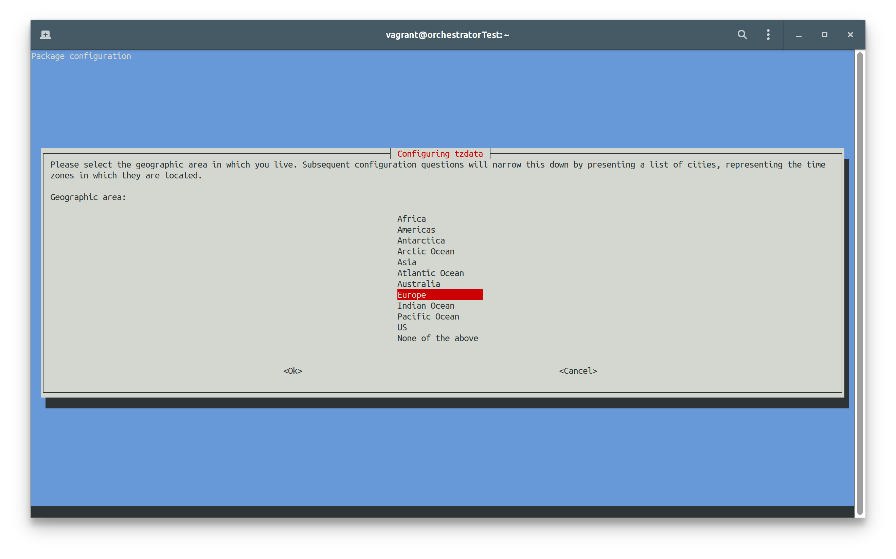
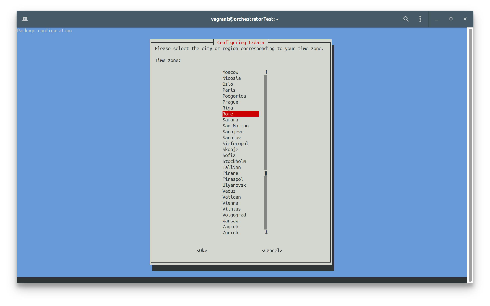
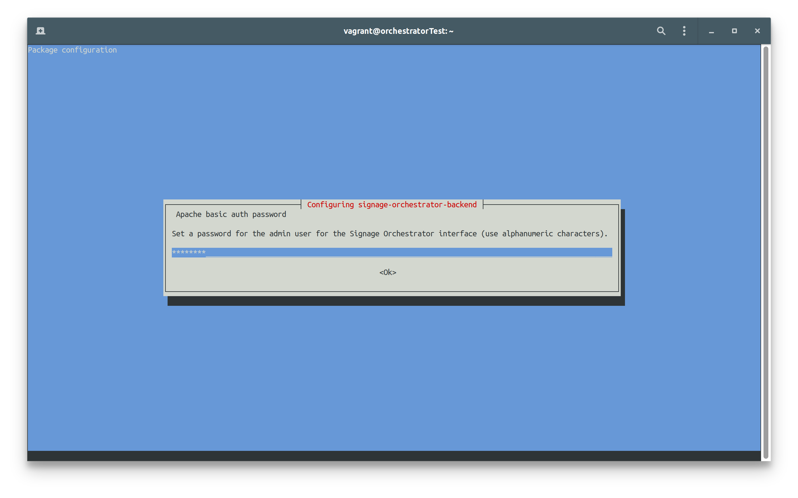

**SIGNAGE ORCHESTRATOR** 

Signage Orchestrator is a central web interface you can use to schedule Raspberry Slideshow and Raspberry Digital Signage units (“players”) to slide media/display web urls in a calendar-based timetable.

All available players are enlisted in the Players table (in the image only Slideshow players are available), if configured to use the Orchestrator.

You can add each player to a Group.

Playlists are player configurations. 

Essentially, for Raspberry Slideshow a playlist is the <em>media.conf</em> directives, plus the transition and blend time of images:

For Raspberry Digital Signage, a playlist contains the following information:

In the Events tab you can schedule a group of players to use a playlist (of course, Raspberry Slideshow players can only run Slideshow Playlists, while Raspberry Digital Signage players are only able to run Web Signage Playlists):

Please note that in the Events tab you need to select the Group, then all events related to it will be displayed.

When adding a new event, just give it a name, then click on it, use the modification icon and assign it a playlist (as in the last image here above). 

In the images, for example, all the players associated to the "Mall public players group" will be scheduled, according to the calendar, to slide their associated playlist, which can be of course different from event to event.

------------

***Installation***

A x86_64 Debian 12 Bookworm operating system is needed in order to deploy Signage Orchestrator (the platform is not meant to run on Pis; Pis are only used as players).
System must be reachable by Raspberry Slideshow/Digital Signage players, so in the same network or correctly routed.

For testing purposes, a VirtualBox virtual machine with bridged network is fine.

Once installed the operating system, SSH in as root, then give the following commands:

    apt update

    cd /root
    wget https://github.com/marco-buratto/signage-orchestrator/releases/download/v1.2/signage-orchestrator-backend_1.2-2_all.deb
    wget https://github.com/marco-buratto/signage-orchestrator/releases/download/v1.2/signage-orchestrator-ui_1.2-1_all.deb

    apt install -y /root/signage-orchestrator-*.deb

During the installation, debconf will ask you to set the timezone according to yours and to create a password for the admin user of Signage Orchestrator (use *ONLY ALPHANUMERIC* characters), in order to be able to login and connect players.
The following images are shown as an example:

Please be sure the time of the operating system is always correct: configure systemd-timesyncd or install another NTP service for the purpose.

Just a note, the following APT message you'll see at the end of the process is NOT an error:

    N: Download is performed unsandboxed as root as file '/root/signage-orchestrator-backend_1.1-1_all.deb' couldn't be accessed by user '_apt'. - pkgAcquire::Run (13: Permission denied)

------------

***First access***

From your browser of choice, browse to the IP address of the host/vm you have just installed and agree to the security warnings. 
The default installation is deployed with an auto-signed certificate.

Login with *admin* as user and the password you have chosen.

By the way, Signage Orchestrator is designed with security in mind, but of course in production environments or "untrusted networks", a valid TLS certificate is needed to be installed into Apache.

------------

***Players connection***

All configured players (Pis running Raspberry Slideshow or Raspberry Digital Signage) are enlisted in the Players table, if configured.
In order to configure a player, SSH into it as root, then:

    cd /tmp
    wget --no-check-certificate https://ORCHESTRATOR_ADDRESS/raspberry-player/player-connector.sh
    # or wget https://ORCHESTRATOR_ADDRESS/raspberry-player/player-connector.sh with a valid certificate on the Orchestrator.

    bash player-connector.sh --action install --player-type web|slideshow --orchestrator-address ORCHESTRATOR_ADDRESS --orchestrator-password "ORCHESTRATOR_PASSWORD" --player-name "PLAYER_NAME" --player-position "PLAYER_OPTIONAL_POSITION_NOTES" --player-comment "PLAYER_OPTIONAL_COMMENT" --check-tls yes|no

1. [x] *player-type*: on Raspberry Slideshow players use "slideshow"; on Raspberry Digital Signage players use "web".
2. [x] *ORCHESTRATOR_ADDRESS* is the IP address or fqdn of your Signage Orchestrator installation and *ORCHESTRATOR_PASSWORD* is the password chosen when installing.
3. [x] *PLAYER_NAME*, *PLAYER_OPTIONAL_POSITION_NOTES*, *PLAYER_OPTIONAL_COMMENT* are properties of the player (Raspberry unit) itself, so how it will be displayed in the Orchestrator interface.
4. [x] *check-tls*: use "no" unless you have installed a valid certificate on the Orchestrator.

***Players connection debug***

After the procedure completes, the player should be enlisted in the Orchestrator Players tab.
If not, there's an error somewhere: try launching the connection script manually (within the same malfunctioning player, of course as root):

    sed -i 's|/tmp/orchestrator.response 2>/dev/null|/tmp/orchestrator.response|g' /usr/bin/player.sh
    /usr/bin/player.sh

On network or any fatal error (if any), you could now see the details.

If otherwise no error is displayed, you can see the Orchestrator response with:

    cat /tmp/orchestrator.response | jq

If something like:

    {
        "data": {
           "orchestrator_ssh_public_key": "ecdsa-sha2-nistp256 ... root@orchestratorTest"
        } 
    }

is displayed, the communication is ok, so the player *is* correctly connected to the Orchestrator. Re-check all the previous steps if the player is still not visible on the Orchestrator GUI.

***Connection ok, but nothing happens on the player***

Re-checking here all the necessary steps on the Orchestrator (with Slideshow player types as example).
1. the Player must be in a group;
2. create a slideshow playlist, for example with just one media.conf directive inside:

       url: https://www.binaryemotions.com/wp-content/uploads/2021/06/digital-signage.jpg
3. in the Events tab, schedule an event: select a group of players on top left, insert an event into the timetable and add the playlist to it.

If all the previous steps have been followed correctly, everything should function as intended.
For any other debug on the player, try having a look at the syslog:

    apt install rsyslog
    tail -f /var/log/syslog # see the output when you expect a player to change its state.

Correct behaviour entries are:

    raspberry-slideshow systemd[1]: Started player.service - Player service.
    raspberry-slideshow systemd[1]: player.service: Deactivated successfully.

***Debugging the Orchestrator***

Orchestrator-side, we can see if, how and when the server communicates with the players with:

    # SSH in as root.
    tail -f /var/log/syslog

A normal output looks like:

    DJANGO_API - ________________________________________________________________________________
    DJANGO_API - List of Event
    DJANGO_API - ________________________________________________________________________________
    DJANGO_API - --> Response: <Response status_code=200, "application/json">
    APACHE_ACCESS_API: 2024-03-15 22:30:00.165 api:80 127.0.0.1 - admin "-" "GET /api/v1/backend/events/?loadGroup=true&loadPlaylist=true&start_date=2024-03-15%2022%3A30 HTTP/1.1" 200 1338 "-" "curl/7.88.1"
    systemd[1]: orchestrator.service: Deactivated successfully.
    root: Processing 192.168.0.118: configuring and starting Raspberry Slideshow...
